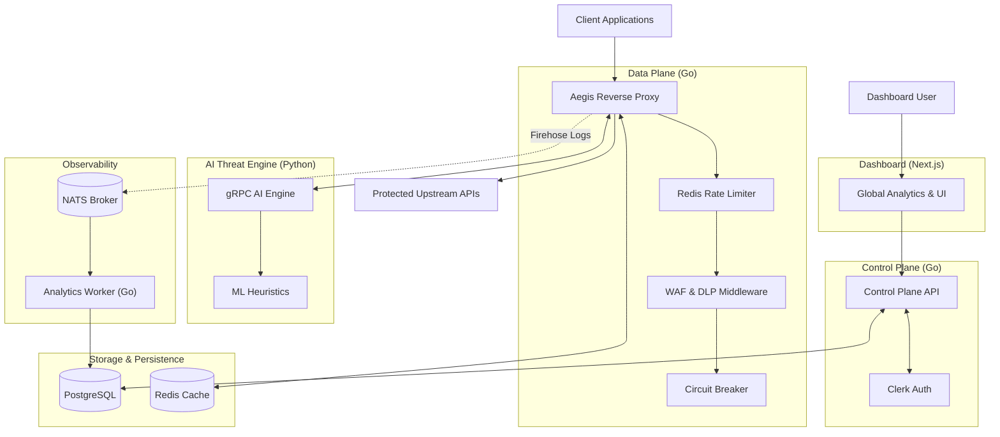

# Aegis Firewall: High-Level Architecture Diagram

---

## 1. The Next.js Dashboard (Frontend)
Built using **Next.js 14, React 19, and TailwindCSS**.
- **Global Organization State:** Implemented a custom React Context (`OrgProvider`) that securely connects with Clerk to grab the user's active `Organization ID`.
- **Live Analytics:** The main dashboard fetches highly optimized `JOIN` query data from the Control Plane, automatically rendering Active Threats, Average Latency, and a real-time feed of recent WAF/AI blocks.
- **Project & Rule Management:** Fully dynamic UI to create new protected projects, generate API Keys, and toggle specific Security Rules (WAF, Rate Limiting, AI Engine) on or off.

## 2. The Control Plane (Go)
The central nervous system of Aegis.
- **Zero-Trust Identity:** Every REST API route is shielded by `AuthMiddleware`, cryptographically verifying Clerk JWTs to ensure that only authenticated users can access the system.
- **Dynamic Multi-Tenancy:** New users who sign up through Clerk are immediately detected. The system automatically creates a new PostgreSQL `Organization` for them and provisions their initial `admin` user role.
- **Role-Based Access Control:** Strict RBAC (`RequireRole("admin", "viewer")`) ensures that viewers can only read analytics, while admins can modify security policies.

## 3. The Data Plane Proxy (Go)
The ultra-fast traffic inspector.
- **Dynamic Routing:** Intercepts traffic, reads the `X-API-Key` header, and looks up the upstream routing configuration in memory (or PostgreSQL) before blindly forwarding traffic.
- **Layered Security Pipeline:** 
  1. **Rate Limiting:** Uses a distributed Token Bucket algorithm backed by Redis to prevent volumetric DDoS attacks.
  2. **WAF:** Scans for RegEx-based SQLi, XSS, and Path Traversal.
  3. **AI Blocker:** Triggers the Python engine via gRPC for Zero-Day threat detection.
  4. **DLP (Egress):** Scans the *outgoing* HTTP responses to prevent PII (Credit Cards, SSNs, Emails) from leaking.
- **Resilience:** Implemented a **"Fail-Open"** Circuit Breaker. If an upstream service is down, the Circuit Breaker opens and sheds load to protect the proxy. If the AI Engine goes down, the proxy bypasses it so legitimate user traffic is never interrupted!

## 4. The Telemetry Pipeline (NATS + Go)
- **Zero-Latency Logging:** The proxy does NOT write logs directly to PostgreSQL. Instead, it fires a highly-compressed Protobuf event to a `NATS` message broker in microseconds.
- **Analytics Worker:** A separate background Go service (`cmd/analytics-worker`) consumes these messages from NATS and batches them into PostgreSQL. This guarantees that analytics will never slow down API traffic!

## 5. The AI Engine (Python)
- **High-Performance gRPC:** Built using Python 3.11 and gRPC. It receives HTTP headers and bodies over a persistent TCP connection to analyze traffic using advanced heuristics.
- **Zero-Day Catching:** Catches complex Prompt Injections, obfuscated SQLi, and anomaly-based threats that easily bypass traditional RegEx WAF rules.
