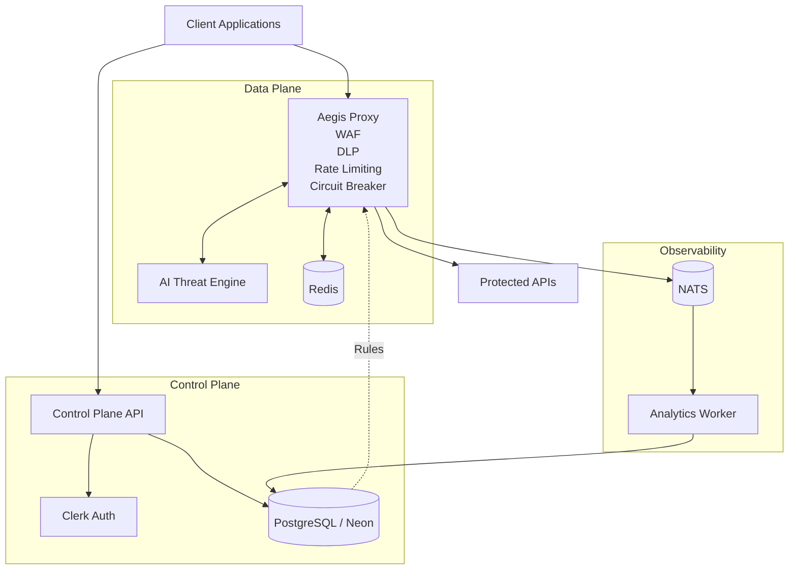

# Aegis AI-Powered API Firewall

Aegis is an enterprise-grade, language-agnostic API Security Firewall. Designed with a Zero-Trust architecture, Aegis acts as a highly-performant reverse proxy sitting in front of your upstream services. It actively inspects, scores, and filters incoming HTTP traffic using traditional WAF rulesets combined with advanced AI threat detection.

## 🏗️ System Architecture

Aegis is composed of a microservices architecture designed for extreme horizontal scalability, sub-millisecond latency, and real-time observability.




### Core Components

1. **Control Plane (`/cmd/control-plane`)**
   - **Role:** Centralized configuration API and Identity provider.
   - **Tech Stack:** Go 1.21, PostgreSQL (Neon), Clerk SDK.
   - **Functionality:** Provides the REST APIs consumed by the Aegis Dashboard. Handles User Auto-provisioning, Organization (Tenant) management, Role-Based Access Control (RBAC), and Project/Security Rule CRUD operations.

2. **Data Plane Reverse Proxy (`/cmd/proxy`)**
   - **Role:** High-throughput traffic inspector and router.
   - **Tech Stack:** Go 1.21, Redis, NATS, gRPC.
   - **Functionality:** Intercepts traffic destined for upstream services. Retrieves active security rules from PostgreSQL, executes local threat heuristics, triggers the AI Engine via gRPC, and publishes traffic logs to NATS. It enforces WAF configurations, DLP (Data Loss Prevention), and Rate Limiting using Redis.

3. **Analytics Worker (`/cmd/analytics-worker`)**
   - **Role:** Asynchronous telemetry aggregator.
   - **Tech Stack:** Go 1.21, NATS, PostgreSQL.
   - **Functionality:** Subscribes to the NATS message broker to ingest firehose traffic logs from the Data Plane proxy. Aggregates data asynchronously to prevent the Proxy from experiencing latency degradation, before persisting normalized metrics into PostgreSQL.

4. **AI Threat Engine (`/ai-engine`)**
   - **Role:** Machine Learning threat evaluator.
   - **Tech Stack:** Python 3.11, gRPC, Protobuf.
   - **Functionality:** Communicates with the Data Plane proxy via ultra-fast gRPC. Analyzes HTTP request headers, query parameters, and payloads to identify sophisticated zero-day attacks (e.g., SQL Injection, XSS, Command Injection) that bypass traditional RegEx WAF rules.

---

## 🔒 Authentication & RBAC

Aegis enforces a strict **Zero-Trust** policy on the Control Plane:
- All administrative requests must carry a valid Clerk JSON Web Token (JWT).
- The Control Plane cryptographically verifies JWTs against Clerk's public JWKS.
- **Dynamic Multi-Tenancy:** New users are automatically provisioned an isolated "Personal Workspace" in PostgreSQL upon their first login.
- **Role-Based Access Control:** Mutations (`POST`, `PUT`, `DELETE`) require `admin` privileges. Read-only actions (`GET`) can be accessed by `viewer` privileges.

---

## ⚙️ Prerequisites

To run the Aegis infrastructure locally, ensure you have the following installed:
- [Docker Desktop](https://www.docker.com/) (or Docker Compose)
- [Go 1.21+](https://go.dev/)
- [Python 3.11+](https://www.python.org/)
- Protoc (Protocol Buffers Compiler)

---

## 🚀 Installation & Local Development

### 1. Environment Configuration
Create a `.env` file in the root of this repository and populate it with your Clerk API keys:
```env
# Clerk Authentication Configuration
CLERK_SECRET_KEY=sk_test_...
```

### 2. Infrastructure Setup
The `docker-compose.yml` file is configured to spin up your local Redis and NATS instances.
*(Note: PostgreSQL is hosted serverlessly via Neon, but local PostgreSQL is available if needed).*
```bash
make up
```

### 3. Running the Microservices
Because of the distributed architecture, it is highly recommended to run the services in separate terminal windows to monitor their respective logs effectively.

**Terminal 1: Control Plane** (API for the Dashboard)
```bash
make run-control-plane
```
*Runs on `http://localhost:8081`*

**Terminal 2: Data Plane Proxy** (The Firewall)
```bash
make run-proxy
```
*Runs on `http://localhost:8080`*

**Terminal 3: Analytics Worker** (Telemetry Ingestion)
```bash
make run-analytics-worker
```

**Terminal 4: AI Engine** (Python gRPC Server)
```bash
make setup-ai    # Sets up your virtual environment
make run-ai      # Starts the gRPC Server on port 50051
```

---

## 🛠️ CLI Make Commands Reference

| Command | Description |
|---|---|
| `make up` | Starts local infrastructure (Redis, NATS, Postgres) via Docker Compose |
| `make down` | Stops the local Docker containers |
| `make clean` | Stops containers and destroys their data volumes (WARNING: Loss of data) |
| `make run-control-plane`| Starts the Go REST API for the frontend Dashboard |
| `make run-proxy` | Starts the Go Reverse Proxy and Firewall Engine |
| `make run-analytics-worker` | Starts the Go NATS subscriber for logging analytics |
| `make generate-proto` | Compiles `.proto` files into Go and Python gRPC stubs |
| `make migrate-up` | Runs golang-migrate to apply the latest database schema |
| `make test` | Runs all `_test.go` suites using the race detector |
| `make mod-tidy` | Tidies Go modules across the workspace |
